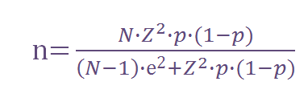
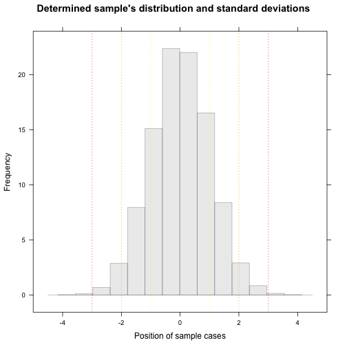

App to calculate a proper sample for a poll
========================================================
author: Rafael Sierra
autosize: true
date: Sat Jan 30 10:18:20 2016

Github Repository:
https://github.com/rflsierra/DevelopingDataProducts-PeerAssessment

Developing Data Products - Reproducible Pitch - Peer Assessment


About the app
========================================================

Objectives:

- Calculates the sample size required when applying a poll given certain restrictions provided by the user.
- Calculates the cost of such study and its relation to the allocated budget for the project.
- Provides the capability to interact and adjust inputs in order to obtain an optimal combination. 

The whole code is contained in a file called app.R, which has the ui.R and the server.R parts. Recently, Shiny allows you to do so in just one file, which seems much more elegant and organised, keeping in all cases the content and performance of the ui.R and server.R

About the Inputs
========================================================

To calculate the sample size:

- Margin of error allowed (min = 0.5%, max = 10.0%).
- Confidence level (90%, 95% and 99%).
- Population size (min = 10000, max = 100000).


```r
sliderInput(inputId = "error", label = "Desired error (%)", min = 0.5, max = 10.0, step = 0.1, value = 0.5)
```

***

To calculate costs and feasibility:

- Cost per interview (min = 10, max = 100).
- Total available budget (min = 500, max = 1000000).


```r
numericInput(inputId = "cost", label = "Cost per interview (USD)", min = 10, max = 100, step = 5, value = 10)
```

About the Calculations
========================================================

The calculations are mainly based in the following formula to determine the sample size of a population for a given error, confidence interval and Universe:



***

Where:

- N is the Universe.
- Z is a value determined for each confidence level.
- e is the maximun error allowed. 
- p is the proportion, that has been fixed for this example in 50%.

About the Outputs
========================================================

There are 3 outputs:

- A text box with the number of cases required in the sample.

- A plot showing the costs related to the number of cases evaluated.

- A plot evaluating a normal distribution for the sample size (example values presented):

***

 
